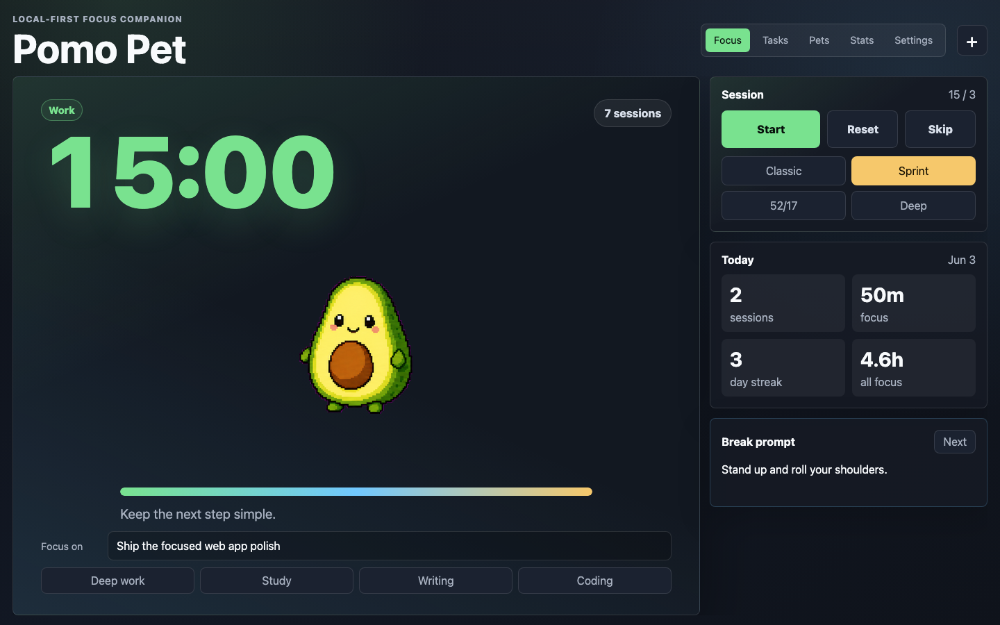
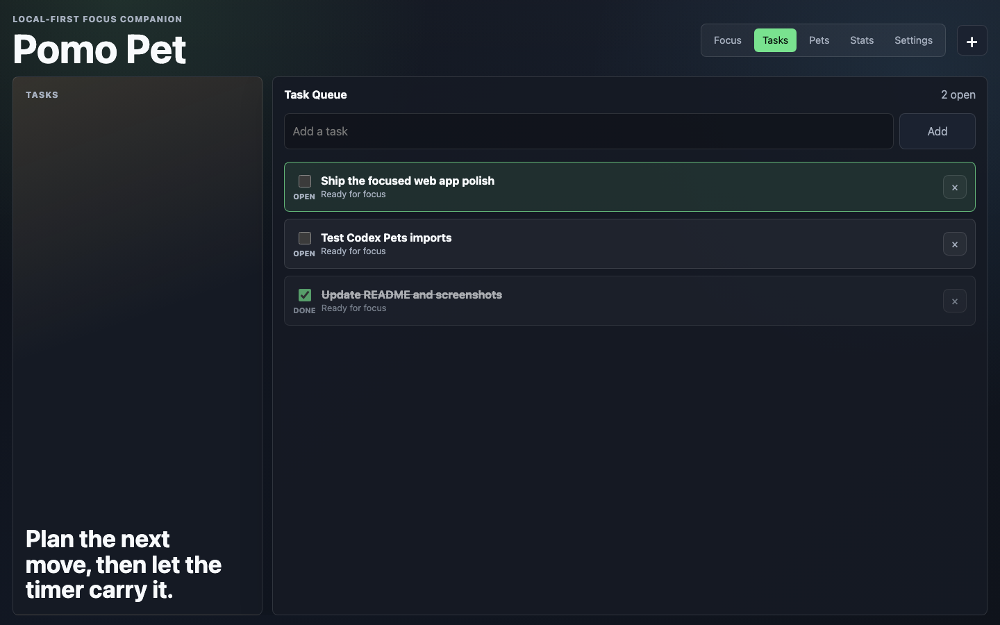
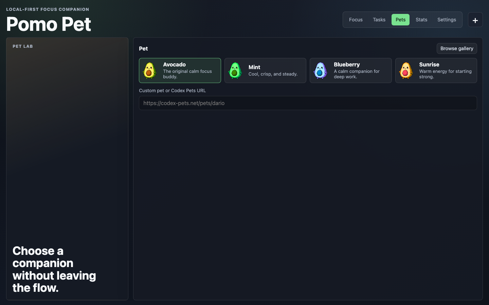
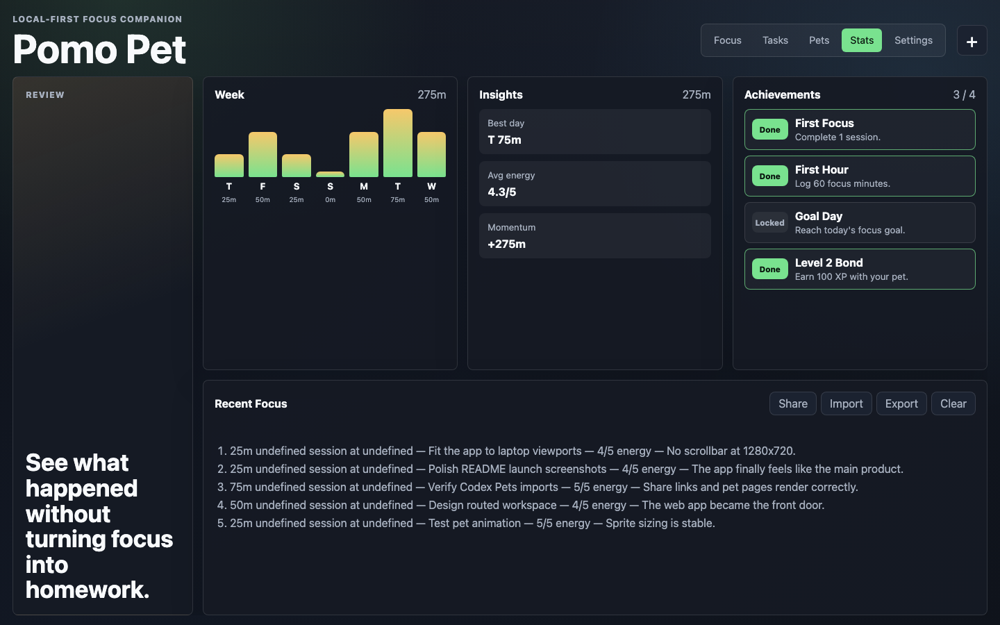

# Pomo Pet

**A local-first Pomodoro web app with animated pets, tasks, stats, and a desktop companion**

[](https://python.org)
[](LICENSE)
[](#testing)

Pomo Pet is now primarily an installable, local-first web app. It gives you a
focused Pomodoro workspace with animated pets, built-in tasks, Codex Pets
imports, local stats, achievements, session reflections, offline support, and
PWA install metadata. The original Python desktop pet is still available as a
secondary always-on-top companion for people who want a tiny floating timer.

## Web App

Public app: <https://someshfengde.github.io/pomo_pet/>

The web app lives in `docs/` and can run as a static site, GitHub Pages app, or
installable PWA. It is organized as a multi-page hash-routed workspace:

- `#/focus` — timer stage, animated pet, focus intention, presets, today's stats, and break prompts.
- `#/tasks` — local task queue for planning, selecting, and completing focus targets.
- `#/pets` — bundled pet variants plus custom Codex Pets links, pet pages, API URLs, and direct spritesheets.
- `#/stats` — weekly chart, insights, achievements, session history, reflections, import/export, and share summary.
- `#/settings` — duration controls, daily goal, bond progress, notifications, gentle tick, wake lock, install, and storage readiness.

Everything is local-first: tasks, settings, stats, reflections, imported pets,
and achievements stay in browser storage unless you export/share them yourself.

### Screenshots

| Focus | Tasks |
|-------|-------|
|  |  |

| Pet Lab | Stats |
|---------|-------|
|  |  |

## Quick Start

### Web

```bash
python3 -m http.server 4173 --directory docs
# Open http://127.0.0.1:4173
```

### Desktop Companion

```bash
# Install with Homebrew (recommended)
brew tap someshfengde/pomo-pet
brew install pomo-pet

# Or install with curl
curl -sSL https://raw.githubusercontent.com/someshfengde/pomo_pet/main/install.sh | bash

# Launch (default: avocado pet, 25min work / 5min break)
pomo-pet start

# Or pick a pet
pomo-pet start avocado
```

## Desktop Usage

```bash
pomo-pet start              # Launch default pet (avocado)
pomo-pet start avocado      # Launch specific pet
pomo-pet list               # See available pets
pomo-pet stats              # View session statistics
pomo-pet stats --format json  # Export stats as JSON
pomo-pet config             # View all config settings

# Presets
pomo-pet presets            # List Pomodoro technique presets
pomo-pet apply classic      # Apply classic 25/5 preset
pomo-pet apply 52-17        # Apply 52/17 rule preset

# Custom durations
pomo-pet --work 30 --break 10 start

# Disable sounds
pomo-pet --no-sound start

# Persistent config
pomo-pet config work_minutes 30
pomo-pet config volume 50
```

## Desktop Controls

| Action | How |
|--------|-----|
| Move pet | Click + drag (or arrow keys) |
| Pause / Resume | Single click (or `Cmd+Shift+P`) |
| Reset timer | Double click (or `Cmd+Shift+R`) |
| Context menu | Right-click |
| Skip phase | Right-click → Skip Phase |
| Hide/Show pet | Right-click → Hide/Show |
| Mini mode | Right-click → Mini Mode |
| Quit | `Q` / `ESC` / Right-click → Quit |

**Keyboard shortcuts:** `Cmd+Shift+P` pause · `Cmd+Shift+R` reset · `Cmd+Shift+Q` quit · Arrow keys nudge position

## Features

- **Installable web app** — PWA in `docs/` with offline support, responsive app-style routes, and local stats
- **Viewport-fit workspace** — laptop and desktop layouts fit the visible screen without document scrollbars
- **Built-in focus tasks** — add/select/complete tasks directly in the web app; selected tasks become the active focus intention
- **Codex Pets support** — import custom pets from direct spritesheets, `codex-pets.net/pets/{slug}`, `share/{slug}`, or API URLs
- **Web review tools** — weekly chart, insights, daily goal ring, achievements, history, reflections, import/export, and share summary
- **Local-first storage** — settings, task lists, sessions, reflections, achievements, and imported pets stay in the browser
- **Pomodoro timer** — work / break / long break with progress bar
- **Smart long breaks** — every 4th session triggers a 15-minute rest (configurable)
- **Animated desktop pet** — floating transparent window with 9 animation states
- **Always on top** — desktop pet stays visible above all other windows (7-layer reliability)
- **Pet reactions** — animations change based on timer state, hover, dragging
- **Pause indicator** — visual overlay when timer is paused
- **Celebration glow** — golden glow effect when sessions complete
- **Mini mode** — compact timer-only display for minimal overlay
- **Sound effects** — phase changes, session completions, clicks
- **macOS notifications** — native alerts when sessions complete
- **Session statistics** — streaks, total focus time, daily counts (persisted)
- **Right-click menu** — timer status, pause, reset, skip, move-to, hide, mini mode, quit
- **Window position persistence** — remembers where you placed the pet
- **Move-to positions** — quick snap to corners or center
- **Custom messages** — bring your own motivational quotes via file
- **Time-of-day greetings** — morning/afternoon/evening motivational messages
- **System tray** — menu bar icon with pause/reset/quit

## Adding Pets

Create a directory under `pets/` with:

```
pets/mypet/
├── pet.json
└── spritesheet.webp
```

**pet.json:**
```json
{
  "id": "mypet",
  "displayName": "My Pet",
  "description": "A custom pet!",
  "spritesheetPath": "spritesheet.webp",
  "kind": "creature",
  "frameWidth": 192,
  "frameHeight": 192,
  "animations": {
    "idle":      { "row": 0, "frames": 6, "fps": 8,  "loop": true },
    "run_right": { "row": 1, "frames": 8, "fps": 12, "loop": true },
    "run_left":  { "row": 2, "frames": 8, "fps": 12, "loop": true },
    "waving":    { "row": 3, "frames": 4, "fps": 8,  "loop": true },
    "jumping":   { "row": 4, "frames": 5, "fps": 10, "loop": true },
    "failed":    { "row": 5, "frames": 8, "fps": 10, "loop": false },
    "waiting":   { "row": 6, "frames": 6, "fps": 6,  "loop": true },
    "running":   { "row": 7, "frames": 6, "fps": 10, "loop": true },
    "review":    { "row": 8, "frames": 6, "fps": 8,  "loop": true }
  }
}
```

Browse [Codex Pets](https://codex-pets.net/) for compatible pet pages and
spritesheets. The web app accepts links such as
`https://codex-pets.net/pets/dario` and reads available pet metadata for correct
frame sizing.

## Development

```bash
make install    # Install dependencies
make test       # Run Python tests
make test-all   # Run with coverage
make run        # Launch with avocado
make app        # Build macOS .app bundle
make app-dmg    # Build DMG for distribution
```

## Web App / PWA

The PWA also includes offline caching, install metadata, social preview tags,
structured data, a generated preview image, service worker, notification support,
browser title timer sync, and optional screen wake lock during running sessions.

## Testing

Python desktop behavior, static PWA checks, and browser workflows are covered by:

```bash
make test
pytest tests/test_web_pwa.py
python scripts/audit_pwa.py
npm run test:web
```

**Project structure:**
```
src/
├── cli.py              # Click CLI with subcommands
├── core/
│   ├── timer.py        # PomodoroTimer (pause, reset, skip, long breaks)
│   ├── messages.py     # Phase-aware messages (work, break, long break)
│   ├── stats.py        # Session statistics with streak tracking
│   └── config.py       # Persistent config (~/.pomo-pet/config.json)
├── pets/
│   ├── models.py       # Pet, AnimationDef
│   ├── loader.py       # Load from pet.json
│   └── renderer.py     # Pillow spritesheet utils
└── ui/
    ├── theme.py        # Design tokens & colors
    ├── window.py       # PySide6 window, animations, context menu
    ├── sounds.py       # Sound effects (macOS afplay)
    ├── notifications.py # macOS native notifications
    └── tray.py         # System tray integration
docs/
├── index.html          # Static PWA app shell
├── app.js              # Browser timer, task list, pet gallery, stats, notifications
├── styles.css          # Responsive web UI
├── assets/preview.png  # Social/install preview image
├── assets/screenshots/ # README screenshots for the web app
├── manifest.webmanifest
└── sw.js               # Offline service worker
scripts/
└── audit_pwa.py        # Static PWA launch/installability and repo-safety audit
```

## License

MIT
